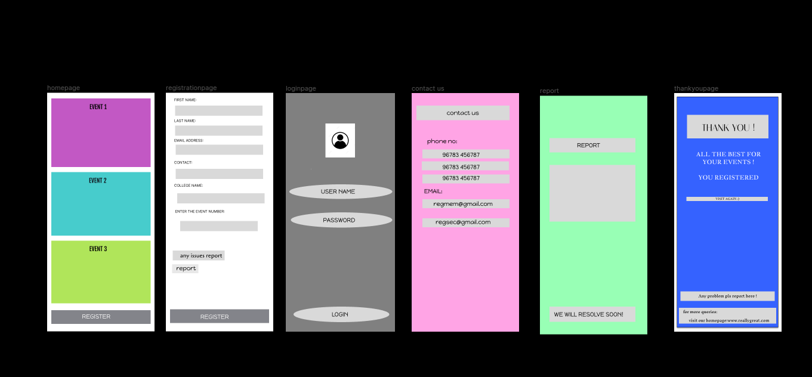

# Event Registration Web Application

## AIM:
To design, develop and deploy a web application for event registration.

## DESIGN STEPS:

### Step 1:
create a number of pages as needed

### Step 2:
design the each webpages

### Step 3:
create a html and css for the webpages

### Step 4:
add the needed images for the webpage

### Step 5:
add styles for the web pages
### Step 6:

Validate the HTML and CSS code.

### Step 6:

Publish the website in the given URL.
## Design tool:

## Result:
thus the experiment executed sucessfully
